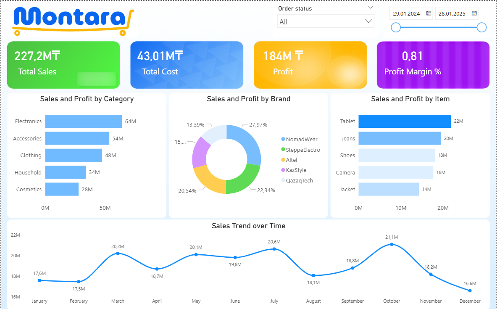

# 📊 Sales Performance Dashboard (Power BI)

## 📌 Goal
The goal of this project is to analyze sales performance, identify key trends, and provide actionable insights to support business decision-making.

---

## 🛠 Tools Used
- Power BI
- Excel / CSV dataset
- Data cleaning and transformation

---

## 📂 Dataset
The dataset includes:
- Sales transactions
- Product categories
- Regions
- Revenue and profit metrics

---

## 📈 Dashboard Overview
The dashboard provides an interactive view of:
- Total Revenue and Profit
- Sales by Region
- Top-performing Products
- Monthly Sales Trends

---

## 🔍 Key Insights
- A small number of products generate the majority of revenue (Pareto effect)
- Certain regions consistently outperform others in sales and profitability
- Seasonal trends show increased sales during specific periods
- Some products have high sales but low profitability, indicating pricing or cost issues

---

## 💡 Business Impact
- Helps identify high-performing regions and products
- Supports strategic decision-making for pricing and inventory
- Enables stakeholders to monitor KPIs in real time
- Highlights opportunities to improve profit margins

---

## 🖼 Dashboard Preview
(Add screenshot here)

---

## 🚀 Conclusion
This dashboard enables data-driven decision-making by transforming raw sales data into clear and actionable insights.
